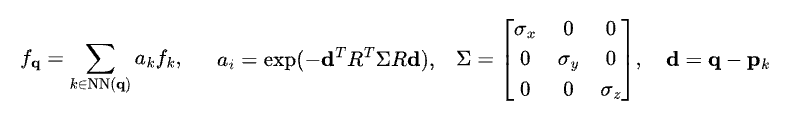

# kNN Feature aggregation in CUDA

This is a CUDA PyTorch binding of kNN feature aggregation with anisotropic gaussian weighting.

## How does it work?
Given `q` the query points, and `p` the feature point clouds, the function finds the k nearest neighbors of each query in the feature point clouds. The feature of the query is then determined by a weighted sum of the features from the k neighbors.

In particular, we compute


where
- `q (B, Q, 3)` is the query point coordinate with `B` batches, `Q` points
- `p (B, P, 3)` is the feature point coordinate with `B` batches, `P` points
- `f (B, P, F)` is the feature of the feature point associated with `p`
- `R (B, P, 3, 3)` is the rotation matrix of the gaussian.
- `sigma (B, P, 3)` is the scale of the gaussian for each point.
Note that we split the covariance matrix into rotation and scale.

## Installation
Preqrequisites:
```
Python >= 3.8
CUDA >= 11.0
PyTorch >= 2.0.0
```

To install, simply do
```
pip install .
```

## TODO:
- [ ] Complete README
- [X] Installation instructions
- [ ] Example
- [ ] Python packaging